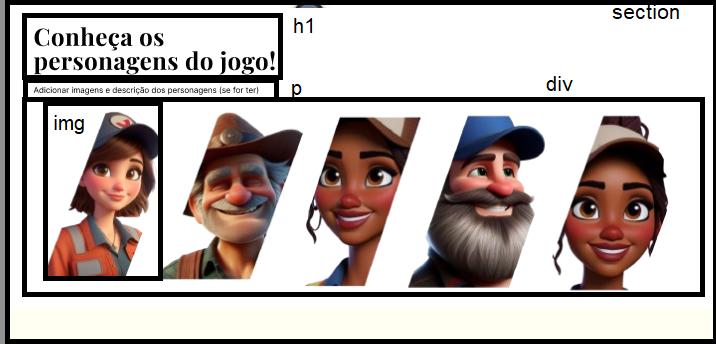
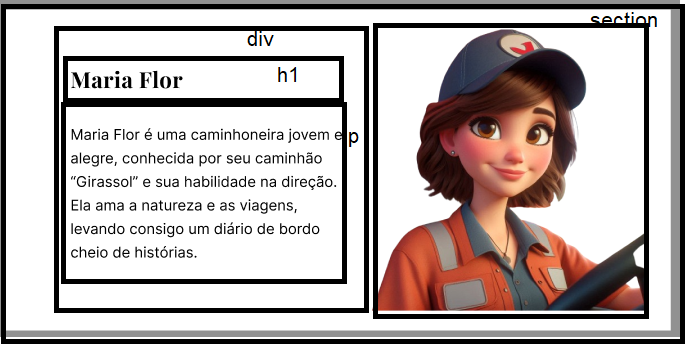

# Sobre criar as sessões

A estrutura é essa:

## PARTE 1



```html
<section>
       <h1>Conheça ...</h1>
       <p>add a descrição dis personages</p>
       <div>
            
            
            
            
            
       </div>
    </section>
```

## PARTE 2




```html
<section>
     <div>
          <h1> </h1>
          <p> 

          </p>
     </div>
     
</section>
```